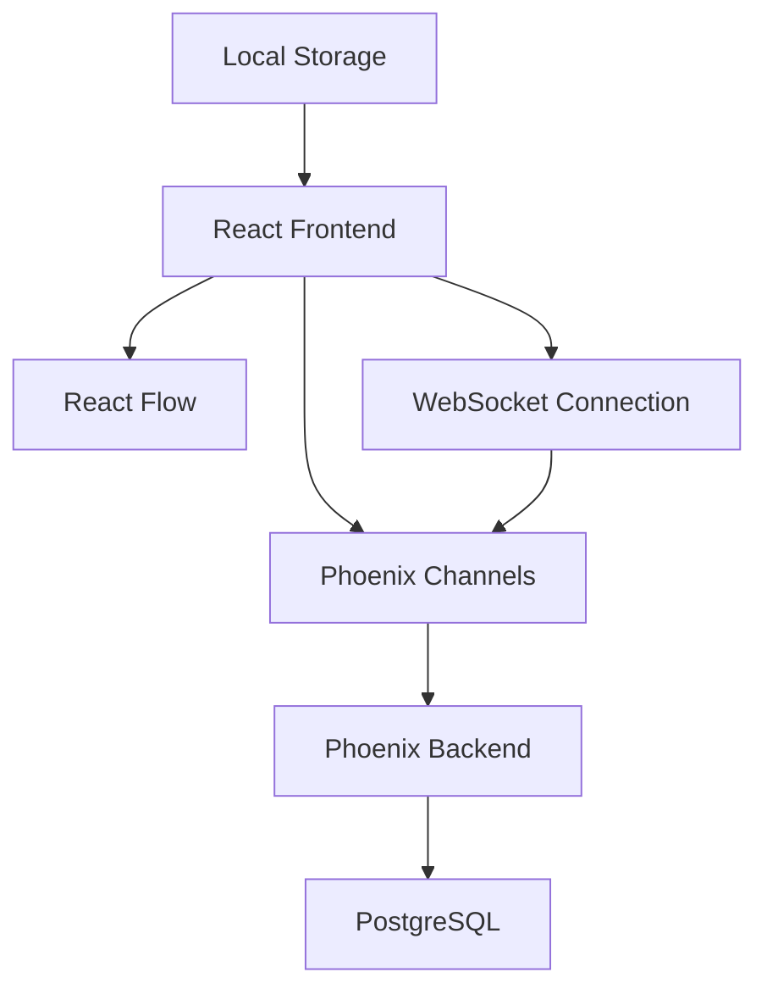

<div align="center">

# 🧬 Helix

**Visual AI Agent Workflow Designer**

_Plan, design, and visualize complex AI agent workflows with intuitive drag-and-drop interface_

[](https://github.com/ccarvalho-eng/helix/releases)
[](https://github.com/ccarvalho-eng/helix/actions/workflows/ci.yml)
[](https://codecov.io/gh/ccarvalho-eng/helix)
[](https://www.apache.org/licenses/LICENSE-2.0)

[Features](#-features) • [Getting Started](#-getting-started) • [Tech Stack](#-tech-stack) • [Contributing](#-contributing)

---

</div>

## 🎯 Overview

Helix is a modern visual workflow designer specifically built for planning AI agent interactions and multi-agent systems. Design complex workflows with an intuitive node-based interface, complete with real-time collaboration features and pre-built templates.

> **Note**: Helix is currently a planning and design tool. Workflows are visual representations and not executable at this time.

## ✨ Features

### 🎨 **Visual Workflow Design**

- Drag-and-drop node-based interface powered by React Flow
- Customizable node types for different AI agent roles
- Visual connections showing agent interactions and data flow
- Intuitive properties panels for node configuration
- Minimap navigation and zoom controls

### 🤝 **Real-Time Collaboration**

- Multiple users can edit workflows simultaneously
- Phoenix Channels for real-time WebSocket communication
- Automatic conflict resolution for concurrent edits
- Session management with unique client IDs

### 🌗 **Modern UI/UX**

- Dark and light theme support with smooth transitions
- Responsive design for desktop and tablet devices
- Professional styling with Tailwind CSS
- Error boundaries for robust error handling

### 💾 **Workflow Management**

- Create, save, and load workflow configurations
- Flow duplication with proper ID remapping
- Local storage persistence
- Flow metadata tracking (creation date, modification time, node/edge counts)

## 🚀 Getting Started

### Prerequisites

- **Elixir** 1.17+
- **Erlang/OTP** 26+
- **Node.js** 18+
- **PostgreSQL** 14+

### Installation

1. **Clone the repository**

   ```bash
   git clone https://github.com/ccarvalho-eng/helix.git
   cd helix
   ```

2. **Install dependencies**

   ```bash
   mix setup
   ```

3. **Start the development server**

   ```bash
   mix phx.server
   ```

4. **Open your browser**

   Navigate to [`http://localhost:4000`](http://localhost:4000)

### Development Commands

```bash
# Run tests
mix test
npm test

# Code quality checks
mix credo --strict
npm run lint
npm run typecheck

# End-to-end tests
npm run test:e2e

# Format code
mix format
npm run prettier
```

## 🛠 Tech Stack

### Backend

- **[Phoenix Framework](https://phoenixframework.org/)** - Web framework
- **[Elixir](https://elixir-lang.org/)** - Functional programming language
- **[PostgreSQL](https://postgresql.org/)** - Database
- **[Phoenix Channels](https://hexdocs.pm/phoenix/channels.html)** - Real-time WebSocket communication

### Frontend

- **[React](https://react.dev/)** - UI framework (v19.1+)
- **[TypeScript](https://typescriptlang.org/)** - Type safety
- **[React Flow](https://reactflow.dev/)** - Node-based UI components
- **[Tailwind CSS](https://tailwindcss.com/)** - Styling
- **[Lucide Icons](https://lucide.dev/)** - Icon library

### Testing & Quality

- **[ExUnit](https://hexdocs.pm/ex_unit/)** - Elixir testing
- **[Jest](https://jestjs.io/)** - JavaScript testing
- **[Playwright](https://playwright.dev/)** - E2E testing
- **[Credo](https://hex.pm/packages/credo)** - Code analysis
- **[ESLint](https://eslint.org/)** - JavaScript linting

## 🏗 Architecture



- **Real-time collaboration** via Phoenix Channels and WebSockets
- **Component-based** React architecture with TypeScript
- **Node-based workflow** representation using React Flow
- **RESTful API** for workflow CRUD operations
- **Client-side storage** with localStorage persistence
- **Session management** for multi-user collaboration

## 🤝 Contributing

We welcome contributions! Please see our [Contributing Guide](CONTRIBUTING.md) for details.

### Quick Start for Contributors

1. Fork the repository
2. Create a feature branch: `git checkout -b feature/amazing-feature`
3. Make your changes and add tests
4. Run the test suite: `npm run test:all && mix test`
5. Commit using [Conventional Commits](https://conventionalcommits.org/)
6. Push to your fork and submit a pull request

## 📝 License

This project is licensed under the Apache License 2.0 - see the [LICENSE](LICENSE) file for details.

## 🙏 Acknowledgments

- [Phoenix Framework](https://phoenixframework.org/) for the robust backend foundation
- [React Flow](https://reactflow.dev/) for the excellent node-based UI components
- [Tailwind CSS](https://tailwindcss.com/) for the utility-first styling approach

---

<div align="center">

**[⭐ Star this repo](https://github.com/ccarvalho-eng/helix/stargazers) if you find it useful!**

Made with ❤️ for the AI community

</div>
