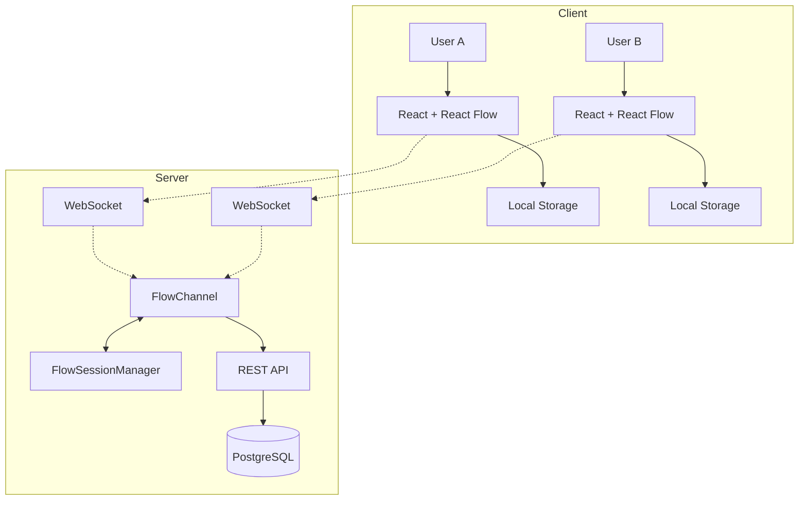

<div align="center">

# 🧬 Helix

**Visual AI Agent Workflow Designer**

*Plan, design, and visualize complex multi-agent workflows with a clean drag-and-drop interface.*

[](https://github.com/ccarvalho-eng/helix/releases)
[](https://github.com/ccarvalho-eng/helix/actions/workflows/ci.yml)
[](https://github.com/ccarvalho-eng/helix/actions/workflows/nightly-e2e-tests.yml)
[](https://codecov.io/gh/ccarvalho-eng/helix)
[](https://www.apache.org/licenses/LICENSE-2.0)

[Features](#-features) • [Getting Started](#-getting-started) • [Architecture](#-architecture) • [Contributing](#-contributing)

---

</div>

## 🎯 Overview

Helix is a **visual workflow designer for AI agents and multi-agent systems**.
Build complex workflows through an intuitive node editor with collaboration, templates, and real-time updates.

> **Note**: Workflows are for **planning & design only** — not executable yet.

---

## ✨ Features

* **Visual Workflow Design**
  Drag-and-drop interface with customizable nodes, connections, minimap, and properties panel.
* **Collaboration**
  Real-time multi-user editing via Phoenix Channels with conflict resolution.
* **Modern UI/UX**
  Light/dark themes, responsive design, Tailwind styling, robust error boundaries.
* **Workflow Management**
  Save, load, duplicate flows, with metadata and local persistence.

---

## 🚀 Getting Started

### Requirements

* Elixir **1.17+**
* Erlang/OTP **26+**
* Node.js **18+**
* PostgreSQL **14+**

### Installation

```bash
# Clone
git clone https://github.com/ccarvalho-eng/helix.git
cd helix

# Setup
mix setup

# Start
mix phx.server
```

Open: [http://localhost:4000](http://localhost:4000)

### Development

```bash
# Tests
mix test
npm test

# Code quality
mix credo --strict
npm run lint
npm run typecheck

# E2E tests
npm run test:e2e

# Formatting
mix format
npm run prettier
```

---

## 🛠 Tech Stack

**Backend:** Phoenix · Elixir · PostgreSQL · Phoenix Channels
**Frontend:** React (19+) · TypeScript · React Flow · Tailwind CSS · Lucide Icons
**Testing:** ExUnit · Jest · Playwright · Credo · ESLint

---

## 🏗 Architecture

### High-Level



* Real-time collaboration through WebSockets + Phoenix Channels
* React Flow for node-based workflow design
* GenServer-based session management with conflict resolution
* RESTful API for workflow CRUD

---

## 🤝 Contributing

1. Fork & branch (`git checkout -b feature/amazing-feature`)
2. Add changes + tests
3. Run full test suite (`npm run test:all && mix test`)
4. Commit using [Conventional Commits](https://conventionalcommits.org/)
5. Open a pull request

See [Contributing Guide](CONTRIBUTING.md) for details.

---

## 📝 License

Apache 2.0 — see [LICENSE](LICENSE).

---

<div align="center">

⭐ If you find Helix useful, [give it a star](https://github.com/ccarvalho-eng/helix/stargazers).

Built with ❤️ for the AI community.

</div>
