<div align="center">

# 🧬 Helix

**Visual AI Agent Workflow Designer**

_Plan, design, and visualize complex multi-agent workflows with a clean drag-and-drop interface._

[](https://github.com/ccarvalho-eng/helix/releases)
[](https://github.com/ccarvalho-eng/helix/actions/workflows/ci.yml)
[](https://github.com/ccarvalho-eng/helix/actions/workflows/nightly-e2e-tests.yml)
[](https://codecov.io/gh/ccarvalho-eng/helix)
[](https://github.com/ccarvalho-eng/helix/actions/workflows/security.yml)

[Features](#-features) • [Getting Started](#-getting-started) • [Architecture](#-architecture) • [Contributing](#-contributing)

---

</div>

## 🎯 Overview

Helix is a **visual workflow designer for AI agents and multi-agent systems**.
Build complex workflows through an intuitive node editor with collaboration, templates, and real-time updates.

> **Note**: Workflows are for **planning & design only** — not executable yet.

---

## ✨ Features

- **Visual Workflow Design**
  Drag-and-drop interface with customizable nodes, connections, minimap, and properties panel.
- **Collaboration**
  Real-time multi-user editing via Phoenix Channels with last-write-wins synchronization.
- **Modern UI/UX**
  Light/dark themes, responsive design, Tailwind styling, robust error boundaries.
- **Workflow Management**
  Save, load, duplicate flows, with metadata and local persistence.

---

## 🚀 Getting Started

### Requirements

- Elixir **1.17+**
- Erlang/OTP **26+**
- Node.js **18+**
- PostgreSQL **14+**

### Installation

```bash
# Clone
git clone https://github.com/ccarvalho-eng/helix.git
cd helix

# Setup
mix setup

# Start
mix phx.server
```

Open: [http://localhost:4000](http://localhost:4000)

### Development

```bash
# Tests
mix test
npm test

# Code quality
mix credo --strict
npm run lint  # Must pass with --max-warnings 0
npm run typecheck

# E2E tests
npm run test:e2e

# Formatting
mix format
npm run prettier
```

---

## 🛠 Tech Stack

| Layer                 | Stack                                                                                                                                                                                                                                                                                                                                                                                                                                                                                                                             |
| --------------------- | --------------------------------------------------------------------------------------------------------------------------------------------------------------------------------------------------------------------------------------------------------------------------------------------------------------------------------------------------------------------------------------------------------------------------------------------------------------------------------------------------------------------------------- |
| **Backend**           |                                                                                                                                                                                            |
| **Frontend**          |                                                                               |
| **Testing & Quality** |      |

---

## 🏗 Architecture

### System Overview


### Real-Time Collaboration Flow


### WebSocket Conflict Resolution

```mermaid
%%{init: {'theme':'neutral'}}%%
flowchart TD
    A[Client A: flow_change] --> B{Connection Status}
    A2[Client B: flow_change<br/>⚡ Concurrent Event] --> B2{Connection Status}

    B -->|Connected| C[FlowChannel handles A]
    B -->|Disconnected| D[❌ Event Lost<br/>No Queuing]

    B2 -->|Connected| C2[FlowChannel handles B]
    B2 -->|Disconnected| D2[❌ Event Lost<br/>No Queuing]

    C --> E[FlowSessionManager.broadcast_flow_change]
    C2 --> E2[FlowSessionManager.broadcast_flow_change]

    E --> F{Active Session?}
    E2 --> F2{Active Session?}

    F -->|Yes| G[✅ Broadcast A to all clients<br/>Last-Write-Wins]
    F -->|No| H[⚠️ Log: No session found]

    F2 -->|Yes| G2[✅ Broadcast B to all clients<br/>⚡ Overwrites A's changes]
    F2 -->|No| H2[⚠️ Log: No session found]

    G --> I[Phoenix.PubSub broadcast]
    G2 --> I2[Phoenix.PubSub broadcast]
    H --> K[❌ Changes discarded]
    H2 --> K2[❌ Changes discarded]

    I --> J[All clients receive A]
    I2 --> J2[All clients receive B<br/>🔄 Conflicts possible]

    J --> L[Frontend applies A]
    J2 --> L2[Frontend applies B<br/>May overwrite A]

    subgraph "Connection Handling"
        M[Connection Lost] --> N{Reconnection?}
        N -->|Success| O[Auto-rejoin channel<br/>🔄 No state sync]
        N -->|Failed| P[Exponential backoff]
        P --> Q{Max attempts<br/>10 retries?}
        Q -->|No| R[Wait + retry]
        Q -->|Yes| S[❌ Give up]
        R --> N
        O --> T[Resume sending events]
    end

    classDef error fill:#ffebee,stroke:#d32f2f,color:#000
    classDef success fill:#e8f5e8,stroke:#388e3c,color:#000
    classDef warning fill:#fff3e0,stroke:#f57c00,color:#000
    classDef conflict fill:#f3e5f5,stroke:#7b1fa2,color:#000
    classDef info fill:#e3f2fd,stroke:#1976d2,color:#000

    class D,D2,H,H2,K,K2,S error
    class G,G2,I,I2,O,T success
    class P,R warning
    class A2,G2,I2,J2,L2 conflict
    class F,F2,N,Q info
```



**Conflict Resolution Strategy:**

- ❌ **No validation**: All changes are accepted and broadcasted immediately
- ⚡ **Last-Write-Wins**: Concurrent changes overwrite each other
- 📡 **No queuing**: Disconnected events are lost (not queued for later)
- 🔄 **No state sync**: Reconnected clients don't get missed changes
- ⚠️ **Session-based**: Only active sessions (with connected clients) receive broadcasts

- Real-time collaboration through WebSockets + Phoenix Channels
- React Flow for node-based workflow design
- GenServer-based session management with last-write-wins synchronization
- RESTful API for workflow CRUD

---

## 🤝 Contributing

1. Fork & branch (`git checkout -b feature/amazing-feature`)
2. Add changes + tests
3. Run full test suite (`npm run test:all && mix test`)
4. Commit using [Conventional Commits](https://conventionalcommits.org/)
5. Open a pull request

See [Contributing Guide](CONTRIBUTING.md) for details.

---

## 📝 License

Apache 2.0 — see [LICENSE](LICENSE).

---

<div align="center">

⭐ If you find Helix useful, [give it a star](https://github.com/ccarvalho-eng/helix/stargazers).

Built with ❤️ for the AI community.

</div>
