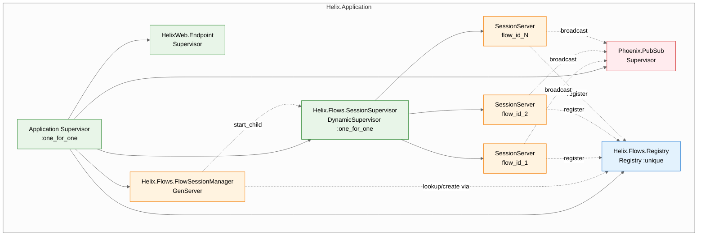
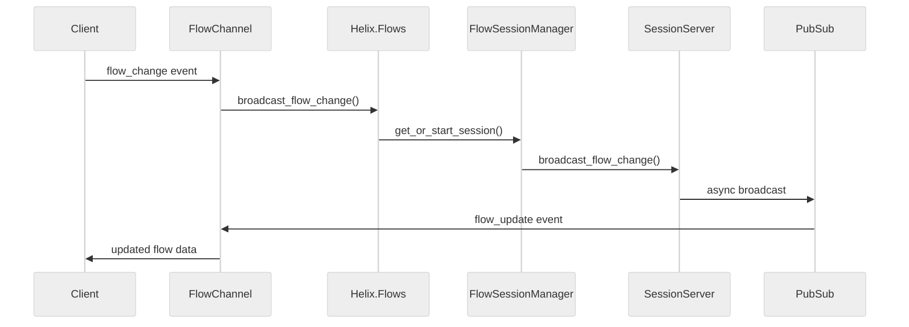

# Architecture

Helix is a real-time collaborative flow builder using Phoenix, WebSocket channels, and OTP supervision for distributed session management.

## OTP Supervision Tree

### OTP Configuration

**Supervision Strategy**: `:one_for_one` with restart limits
- `max_restarts: 10, max_seconds: 60`
- SessionServers restart `:permanent` with `5000ms` shutdown timeout

**Process Isolation**: Each flow gets its own SessionServer process
- Registry prevents race conditions in process discovery
- DynamicSupervisor manages per-flow process lifecycle
- Crashes in one flow don't affect others

**Resource Management**:
- Max 1000 clients per flow (configurable)
- Auto-termination when no clients remain
- 30-minute inactivity timeout

## Real-Time Collaboration

## Key Components

**Helix.Flows** - Boundary module providing public API with input validation

**FlowSessionManager** - Supervisory GenServer managing session lifecycle:
- Registry-based process discovery with `via_tuple`
- DynamicSupervisor integration for race-free process creation
- Flow ID validation and normalization

**SessionServer** - Per-flow GenServer processes:
- Client management (join/leave operations)
- Async PubSub broadcasting to prevent blocking
- Resource limits and auto-cleanup
- Telemetry events for monitoring

**FlowChannel** - Phoenix Channel handling WebSocket connections:
- Automatic session join/leave on connect/disconnect
- Flow change event processing
- Error handling for invalid flow IDs

## Conflict Resolution

- **Last-Write-Wins**: Concurrent changes overwrite each other
- **No queuing**: Disconnected events are lost
- **No state sync**: Reconnected clients don't get missed changes
- **Session-based**: Only active sessions receive broadcasts

## Failure Modes

**Process Crashes**: SessionServers restart with clean state, clients must reconnect

**Resource Exhaustion**: Returns `{:error, :max_clients_reached}` when flow limit exceeded

**Network Partitions**: WebSocket reconnection with exponential backoff, no message queuing

## Monitoring

**Telemetry Events**:
- `[:helix, :session, :client_joined]`
- `[:helix, :session, :client_left]`

**Metrics Available**:
- Active session count via `Flows.get_active_sessions/0`
- Client count per flow via `Flows.get_flow_status/1`
