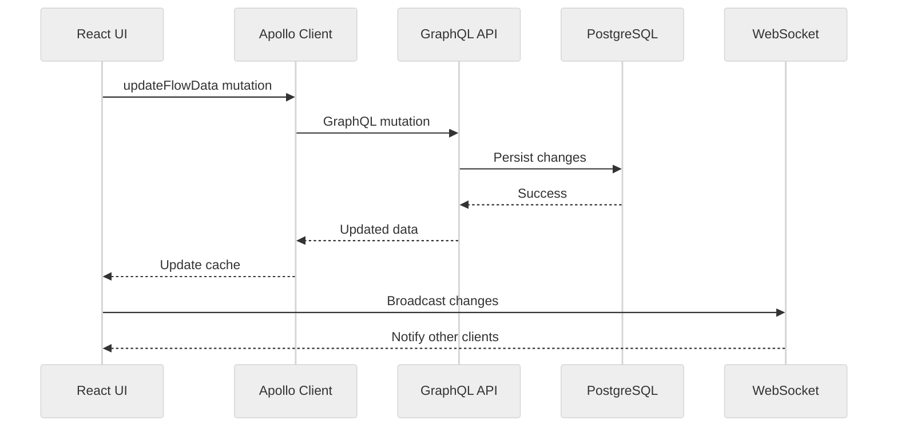
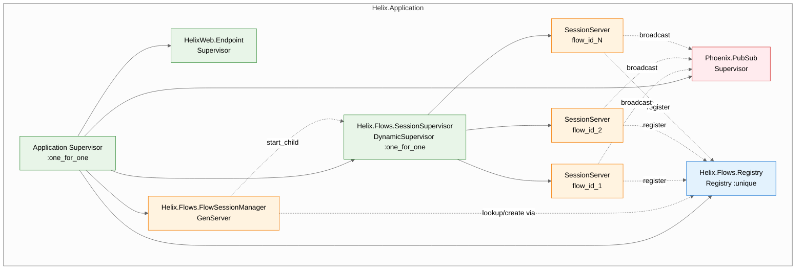
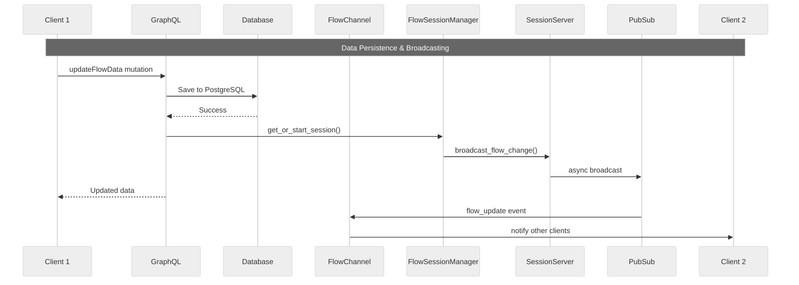

# Architecture

Helix is a real-time collaborative flow builder using GraphQL for data operations, Phoenix WebSocket channels for collaboration, and OTP supervision for distributed session management.

## Technology Stack

**Backend**:
- Elixir/Phoenix - Web framework
- Absinthe - GraphQL server
- PostgreSQL - Data persistence
- Phoenix Channels - WebSocket for real-time collaboration
- OTP/GenServer - Session management

**Frontend**:
- React 19 - UI framework
- Apollo Client 4 - GraphQL client
- ReactFlow - Flow diagram rendering
- TypeScript - Type safety

## Data Layer

### GraphQL API

All data operations are handled through GraphQL:

**Queries**:
- `myFlows` - List all user's flows
- `flow(id)` - Get a specific flow with nodes and edges

**Mutations**:
- `createFlow` - Create new flow
- `updateFlow` - Update flow metadata (title, description, viewport)
- `updateFlowData` - Update nodes and edges (with optimistic locking)
- `deleteFlow` - Soft delete a flow
- `duplicateFlow` - Clone an existing flow

**Schema Conventions**:
- Uses `Absinthe.Adapter.LanguageConventions` for automatic snake_case ↔ camelCase conversion
- Elixir backend uses snake_case (`node_id`, `position_x`)
- GraphQL API exposes camelCase (`nodeId`, `positionX`)

### Data Flow

## OTP Supervision Tree

### OTP Configuration

**Supervision Strategy**: `:one_for_one` with restart limits
- `max_restarts: 10, max_seconds: 60`
- SessionServers restart `:permanent` with `5000ms` shutdown timeout

**Process Isolation**: Each flow gets its own SessionServer process
- Registry prevents race conditions in process discovery
- DynamicSupervisor manages per-flow process lifecycle
- Crashes in one flow don't affect others

**Resource Management**:
- Max 1000 clients per flow (configurable)
- Auto-termination when no clients remain
- 30-minute inactivity timeout

## Real-Time Collaboration

Real-time updates are handled through Phoenix Channels, while data persistence uses GraphQL:

## Key Components

### Backend Components

**GraphQL Schema (`HelixWeb.Schema`)** - API layer:
- Queries for retrieving flows
- Mutations for creating/updating/deleting flows
- Authentication context integration
- Automatic snake_case/camelCase conversion

**Helix.Flows** - Business logic boundary:
- Flow CRUD operations
- Data validation and normalization
- Integration with Storage and Session layers

**Helix.Flows.Storage** - Database persistence:
- Ecto schemas and changesets
- PostgreSQL queries
- Optimistic locking for concurrent updates

**FlowSessionManager** - WebSocket session lifecycle:
- Registry-based process discovery with `via_tuple`
- DynamicSupervisor integration for race-free process creation
- Flow ID validation and normalization

**SessionServer** - Per-flow GenServer processes:
- Client management (join/leave operations)
- Async PubSub broadcasting to prevent blocking
- Resource limits and auto-cleanup
- Telemetry events for monitoring

**FlowChannel** - Phoenix Channel for WebSocket:
- Automatic session join/leave on connect/disconnect
- Receives flow_update events from PubSub and pushes to clients
- Error handling for invalid flow IDs

### Frontend Components

**Apollo Client** - GraphQL client:
- Caching and state management
- Mutation handling with optimistic updates
- Authentication via JWT headers

**useFlowManager Hook** - Flow state management:
- GraphQL queries and mutations
- WebSocket connection management
- Auto-save with 500ms debounce
- Version tracking for optimistic locking

**WebSocket Service** - Real-time collaboration:
- Phoenix Channel connection
- Receives flow_update events from other clients
- Automatic reconnection with exponential backoff

## Conflict Resolution

### Data Persistence
- **Optimistic Locking**: Each flow has a `version` field that increments on every update
- **Version Conflict Detection**: Mutations include the expected version; if mismatched, returns `{:error, :version_conflict}`
- **Client Retry**: Frontend tracks version and retries failed mutations

### Real-time Broadcasting
- **Last-Write-Wins**: Concurrent changes overwrite each other in real-time view
- **No queuing**: Disconnected WebSocket events are lost
- **No state sync**: Reconnected clients don't receive missed changes
- **Session-based**: Only active WebSocket sessions receive broadcasts

### Recommendations
- Coordinate edits when multiple users are editing simultaneously
- Duplicate flows for parallel experimentation
- Save frequently to minimize version conflicts

## Failure Modes

### Backend Failures

**Process Crashes**: SessionServers restart with clean state, clients must reconnect

**Resource Exhaustion**: Returns `{:error, :max_clients_reached}` when flow limit exceeded

**Database Connection Loss**: GraphQL mutations fail, Apollo Client retries with exponential backoff

**Version Conflicts**: Returns `{:error, :version_conflict}`, client must refetch latest version

### Network Failures

**Network Partitions**: WebSocket reconnection with exponential backoff, no message queuing

**GraphQL Request Timeout**: Apollo Client retries failed requests automatically

**Disconnected State**:
- Data persists in database (durable)
- Real-time updates lost (ephemeral)
- Auto-save continues when reconnected

## Monitoring

**Telemetry Events**:
- `[:helix, :session, :client_joined]`
- `[:helix, :session, :client_left]`

**Metrics Available**:
- Active session count via `Flows.get_active_sessions/0`
- Client count per flow via `Flows.get_flow_status/1`
