# Architecture

This document provides detailed technical information about Helix's system architecture, real-time collaboration implementation, and design decisions.

## System Overview


## Real-Time Collaboration Flow

```mermaid
%%{init: {'theme':'neutral'}}%%
sequenceDiagram
    participant UA as 👤 User A
    participant FA as 🖥️ Frontend A
    participant WS as 🌐 WebSocket
    participant FC as 📡 FlowChannel
    participant FBM as 🚪 Helix.Flows
    participant SS as 🧠 SessionServer
    participant PUB as 📢 Phoenix.PubSub
    participant FB as 🖥️ Frontend B
    participant UB as 👤 User B

    UA->>FA: ✏️ Create/Edit Node
    FA->>FA: 💾 Update Local State
    Note over FA: Debounced (500ms)
    FA->>WS: 📤 Send flow_change event
    WS->>FC: 📥 Receive flow_change
    FC->>FBM: 🚀 Flows.broadcast_flow_change()
    FBM->>SS: 🔄 SessionServer.broadcast_flow_change()
    SS->>SS: ⏰ Update last_activity
    SS->>PUB: 📡 Phoenix.PubSub.broadcast
    PUB->>FC: 📢 {:flow_change, data}
    FC->>WS: 📤 Send flow_update
    WS->>FB: 📥 Receive flow_update
    FB->>FB: 🔄 Apply remote changes
    FB->>UB: ✨ Visual update appears

    Note over SS: 📋 Manages client sessions<br/>⏰ Updates activity timestamps<br/>❌ No conflict resolution
    Note over FBM: 🚪 Boundary module API<br/>🔒 Hides implementation details
    Note over PUB: 🚀 Handles message broadcasting<br/>📡 Topic: "flow:#{flow_id}"
```



## WebSocket Conflict Resolution

```mermaid
%%{init: {'theme':'neutral'}}%%
flowchart TD
    A[Client A: flow_change] --> B{Connection Status}
    A2[Client B: flow_change<br/>⚡ Concurrent Event] --> B2{Connection Status}

    B -->|Connected| C[FlowChannel handles A]
    B -->|Disconnected| D[❌ Event Lost<br/>No Queuing]

    B2 -->|Connected| C2[FlowChannel handles B]
    B2 -->|Disconnected| D2[❌ Event Lost<br/>No Queuing]

    C --> E[Flows.broadcast_flow_change<br/>→ SessionServer.broadcast_flow_change]
    C2 --> E2[Flows.broadcast_flow_change<br/>→ SessionServer.broadcast_flow_change]

    E --> F{Active Session?}
    E2 --> F2{Active Session?}

    F -->|Yes| G[✅ Broadcast A to all clients<br/>Last-Write-Wins]
    F -->|No| H[⚠️ Log: No session found]

    F2 -->|Yes| G2[✅ Broadcast B to all clients<br/>⚡ Overwrites A's changes]
    F2 -->|No| H2[⚠️ Log: No session found]

    G --> I[Phoenix.PubSub broadcast]
    G2 --> I2[Phoenix.PubSub broadcast]
    H --> K[❌ Changes discarded]
    H2 --> K2[❌ Changes discarded]

    I --> J[All clients receive A]
    I2 --> J2[All clients receive B<br/>🔄 Conflicts possible]

    J --> L[Frontend applies A]
    J2 --> L2[Frontend applies B<br/>May overwrite A]

    subgraph "Connection Handling"
        M[Connection Lost] --> N{Reconnection?}
        N -->|Success| O[Auto-rejoin channel<br/>🔄 No state sync]
        N -->|Failed| P[Exponential backoff]
        P --> Q{Max attempts<br/>10 retries?}
        Q -->|No| R[Wait + retry]
        Q -->|Yes| S[❌ Give up]
        R --> N
        O --> T[Resume sending events]
    end

    classDef error fill:#ffebee,stroke:#d32f2f,color:#000
    classDef success fill:#e8f5e8,stroke:#388e3c,color:#000
    classDef warning fill:#fff3e0,stroke:#f57c00,color:#000
    classDef conflict fill:#f3e5f5,stroke:#7b1fa2,color:#000
    classDef info fill:#e3f2fd,stroke:#1976d2,color:#000

    class D,D2,H,H2,K,K2,S error
    class G,G2,I,I2,O,T success
    class P,R warning
    class A2,G2,I2,J2,L2 conflict
    class F,F2,N,Q info
```



## Conflict Resolution Strategy

- **No validation**: All changes are accepted and broadcasted immediately
- **Last-Write-Wins**: Concurrent changes overwrite each other
- **No queuing**: Disconnected events are lost (not queued for later)
- **No state sync**: Reconnected clients don't get missed changes
- **Session-based**: Only active sessions (with connected clients) receive broadcasts

## System Architecture

### OTP Design and Supervision Tree

The flow management system follows OTP (Open Telecom Platform) design principles with a simple supervision hierarchy:

```
Phoenix Application
├── Helix.Application (Application)
│   ├── Phoenix.PubSub (Supervisor)
│   ├── HelixWeb.Endpoint (Supervisor)
│   └── Helix.Flows.Supervisor (Supervisor)
│       └── Helix.Flows.SessionServer (GenServer)
```

#### Supervision Strategy
- **Strategy**: `:one_for_one` - If SessionServer crashes, only it gets restarted
- **Restart**: `:permanent` - SessionServer is always restarted if it terminates
- **Shutdown**: `5000` ms - Graceful shutdown timeout

#### Process Responsibilities
- **Helix.Flows.Supervisor**: Manages the SessionServer lifecycle
- **SessionServer**: Single point of truth for all flow session state
- **Phoenix.PubSub**: Message broadcasting infrastructure (separate process)
- **Phoenix Channels**: WebSocket connection handlers (per-connection processes)

#### Design Principles Applied
- **Start Simple**: Single GenServer instead of complex multi-process architecture
- **Let It Crash**: No defensive programming - let OTP handle process failures
- **Single Responsibility**: SessionServer only manages session state
- **Boundary Module**: Helix.Flows provides clean API hiding implementation details

## Key Components

### Helix.Flows Context & SessionServer

**Helix.Flows** - Boundary module:
- Public API for all flow operations
- Supervision tree management
- Documented interface with typespecs

**SessionServer** - GenServer process:
- Tracks active flow sessions and connected clients
- Automatic cleanup of inactive sessions (30-minute timeout)
- Client join/leave operations
- Flow change broadcasting via Phoenix PubSub
- Anonymous client ID generation for invalid inputs
- Client-to-flow mapping for lookups

### Phoenix Channels

Real-time communication via Phoenix Channels:

- `FlowChannel` manages WebSocket connections per workflow
- Handles `flow_change` events from clients
- Broadcasts `flow_update` events to connected clients
- Phoenix PubSub message distribution
- Automatic session join/leave on client connect/disconnect

### Local Storage Persistence

Workflow persistence in browser localStorage:

- Unique workflow IDs and metadata
- Flow data: nodes, edges, viewport state
- Registry with timestamps and counts
- Auto-save with debouncing

## Technology Stack

- **Backend**: Elixir 1.17+, Phoenix Framework
- **Frontend**: React, TypeScript, React Flow, TailwindCSS
- **Database**: PostgreSQL 14+ (development setup)
- **Real-time**: Phoenix Channels, WebSockets
- **State Management**: OTP GenServers, Phoenix PubSub
- **Testing**: ExUnit, Jest, Playwright

## Testing Strategy

The flow management system has comprehensive test coverage:

### Test Coverage (88.3% overall)
- **Helix.Flows**: 100% coverage - All public API functions tested
- **SessionServer**: 91.6% coverage - Comprehensive edge case testing
- **Web Controllers**: 85.7% coverage - HTTP endpoint testing
- **Phoenix Channels**: 83.3%+ coverage - WebSocket communication testing

### Test Categories
- **Unit Tests**: Direct testing of SessionServer GenServer callbacks
- **Integration Tests**: Testing boundary module (Flows) with SessionServer
- **Channel Tests**: WebSocket communication and real-time features
- **Controller Tests**: HTTP API endpoints and error handling
- **Edge Cases**: Invalid inputs, concurrent operations, cleanup scenarios
- **Error Handling**: Network failures, process crashes, invalid data

### Test Structure
- **225+ total tests** covering all aspects of flow management
- **Isolated tests** using unique flow IDs to prevent interference
- **Concurrent operation testing** to ensure thread safety
- **Error scenario testing** for graceful degradation