# Architecture

This document provides detailed technical information about Helix's system architecture, real-time collaboration implementation, and design decisions.

## System Overview


## Real-Time Collaboration Flow

```mermaid
%%{init: {'theme':'neutral'}}%%
sequenceDiagram
    participant UA as 👤 User A
    participant FA as 🖥️ Frontend A
    participant WS as 🌐 WebSocket
    participant FC as 📡 FlowChannel
    participant FBM as 🚪 Helix.Flows
    participant FSM as 🔧 FlowSessionManager
    participant REG as 📋 Registry
    participant SS as 🧠 SessionServer (Per-Flow)
    participant PUB as 📢 Phoenix.PubSub
    participant FB as 🖥️ Frontend B
    participant UB as 👤 User B

    UA->>FA: ✏️ Create/Edit Node
    FA->>FA: 💾 Update Local State
    Note over FA: Debounced (500ms)
    FA->>WS: 📤 Send flow_change event
    WS->>FC: 📥 Receive flow_change
    FC->>FBM: 🚀 Flows.broadcast_flow_change()
    FBM->>FSM: 🔍 Get or start session
    FSM->>REG: 🔎 Registry lookup
    REG->>FSM: 📍 Process PID or create new
    FSM->>SS: 🔄 SessionServer.broadcast_flow_change()
    SS->>SS: ⏰ Update last_activity
    SS->>PUB: 📡 Phoenix.PubSub.broadcast (async)
    PUB->>FC: 📢 {:flow_change, data}
    FC->>WS: 📤 Send flow_update
    WS->>FB: 📥 Receive flow_update
    FB->>FB: 🔄 Apply remote changes
    FB->>UB: ✨ Visual update appears

    Note over SS: 📋 Per-flow process isolation<br/>⏰ Updates activity timestamps<br/>🔄 Self-terminates when empty
    Note over FSM: 🔧 Supervisor process management<br/>🔍 Registry-based discovery<br/>🚀 Race-condition prevention
    Note over FBM: 🚪 Boundary module API<br/>🔒 Hides OTP implementation
    Note over PUB: 🚀 Async message broadcasting<br/>📡 Topic: "flow:#{flow_id}"
```



## WebSocket Conflict Resolution

```mermaid
%%{init: {'theme':'neutral'}}%%
flowchart TD
    A[Client A: flow_change] --> B{Connection Status}
    A2[Client B: flow_change<br/>⚡ Concurrent Event] --> B2{Connection Status}

    B -->|Connected| C[FlowChannel handles A]
    B -->|Disconnected| D[❌ Event Lost<br/>No Queuing]

    B2 -->|Connected| C2[FlowChannel handles B]
    B2 -->|Disconnected| D2[❌ Event Lost<br/>No Queuing]

    C --> E[Flows.broadcast_flow_change<br/>→ SessionServer.broadcast_flow_change]
    C2 --> E2[Flows.broadcast_flow_change<br/>→ SessionServer.broadcast_flow_change]

    E --> F{Active Session?}
    E2 --> F2{Active Session?}

    F -->|Yes| G[✅ Broadcast A to all clients<br/>Last-Write-Wins]
    F -->|No| H[⚠️ Log: No session found]

    F2 -->|Yes| G2[✅ Broadcast B to all clients<br/>⚡ Overwrites A's changes]
    F2 -->|No| H2[⚠️ Log: No session found]

    G --> I[Phoenix.PubSub broadcast]
    G2 --> I2[Phoenix.PubSub broadcast]
    H --> K[❌ Changes discarded]
    H2 --> K2[❌ Changes discarded]

    I --> J[All clients receive A]
    I2 --> J2[All clients receive B<br/>🔄 Conflicts possible]

    J --> L[Frontend applies A]
    J2 --> L2[Frontend applies B<br/>May overwrite A]

    subgraph "Connection Handling"
        M[Connection Lost] --> N{Reconnection?}
        N -->|Success| O[Auto-rejoin channel<br/>🔄 No state sync]
        N -->|Failed| P[Exponential backoff]
        P --> Q{Max attempts<br/>10 retries?}
        Q -->|No| R[Wait + retry]
        Q -->|Yes| S[❌ Give up]
        R --> N
        O --> T[Resume sending events]
    end

    classDef error fill:#ffebee,stroke:#d32f2f,color:#000
    classDef success fill:#e8f5e8,stroke:#388e3c,color:#000
    classDef warning fill:#fff3e0,stroke:#f57c00,color:#000
    classDef conflict fill:#f3e5f5,stroke:#7b1fa2,color:#000
    classDef info fill:#e3f2fd,stroke:#1976d2,color:#000

    class D,D2,H,H2,K,K2,S error
    class G,G2,I,I2,O,T success
    class P,R warning
    class A2,G2,I2,J2,L2 conflict
    class F,F2,N,Q info
```



## Conflict Resolution Strategy

- **Input validation**: Flow IDs are trimmed and validated before processing
- **Error handling**:
  - Join/leave/force-close with invalid flow IDs return `{:error, :invalid_flow_id}`
  - Status checks with invalid flow IDs return an inactive status (no error)
- **Last-Write-Wins**: Concurrent changes overwrite each other (no operational transforms)
- **No queuing**: Disconnected events are lost (not queued for later)
- **No state sync**: Reconnected clients don't get missed changes
- **Session-based**: Only active sessions (with connected clients) receive broadcasts

## System Architecture

### OTP Design and Supervision Tree

The flow management system follows OTP (Open Telecom Platform) design principles with a production-hardened supervision hierarchy:

```
Phoenix Application
├── Helix.Application (Application)
│   ├── Phoenix.PubSub (Supervisor)
│   ├── HelixWeb.Endpoint (Supervisor)
│   ├── Helix.Flows.Registry (Registry)
│   ├── Helix.Flows.SessionSupervisor (DynamicSupervisor)
│   ├── Helix.Flows.FlowSessionManager (GenServer)
│   └── Per-Flow SessionServer Processes
│       ├── SessionServer (flow_id_1)
│       ├── SessionServer (flow_id_2)
│       └── SessionServer (flow_id_N)
```

#### Supervision Strategy

- **Main Strategy**: `:one_for_one` with restart limits (`max_restarts: 10, max_seconds: 60`)
- **DynamicSupervisor**: `:one_for_one` strategy for per-flow SessionServer processes
- **Restart**: `:permanent` - SessionServers are always restarted if they terminate
- **Shutdown**: `5000` ms - Graceful shutdown timeout
- **Restart Intensity Limits**: Prevents supervisor shutdown under burst failures

#### Process Responsibilities

- **Helix.Flows.Registry**: Process discovery and naming (prevents race conditions)
- **Helix.Flows.SessionSupervisor**: DynamicSupervisor managing per-flow SessionServer processes
- **Helix.Flows.FlowSessionManager**: Supervisory process for session lifecycle management
- **SessionServer**: Per-flow GenServer processes managing individual flow session state
- **Phoenix.PubSub**: Message broadcasting infrastructure (separate process)
- **Phoenix Channels**: WebSocket connection handlers (per-connection processes)

#### Design Principles Applied

- **Process Isolation**: Each flow gets its own SessionServer process for fault isolation
- **Registry-Based Discovery**: Race-condition-free process lookup and creation
- **Let It Crash**: Comprehensive crash recovery with clean state restart
- **Resource Management**: Configurable limits and automatic cleanup
- **Supervision Limits**: Prevents supervisor shutdown under failure bursts
- **Boundary Module**: Helix.Flows provides clean API hiding implementation details

#### Production Safety Features

- **Resource Limits**: Maximum 1000 clients per flow (configurable)
- **Memory Protection**: Sessions auto-terminate when no clients remain
- **Inactivity Cleanup**: 30-minute timeout for inactive sessions
- **Restart Limits**: Supervisor won't give up under burst failures
- **Telemetry**: Production monitoring via `:telemetry` events
- **Error Handling**: Graceful degradation with proper error responses

## Key Components

### Helix.Flows Context & SessionServer

**Helix.Flows** - Boundary module:

- Public API for all flow operations (simplified interface)
- Input validation and error handling
- Documented interface with comprehensive typespecs
- Delegates to FlowSessionManager for process management

**Helix.Flows.FlowSessionManager** - Supervisory GenServer:

- Session process lifecycle management
- Registry-based process discovery (`via_tuple` patterns)
- DynamicSupervisor integration for safe process creation
- Race-condition prevention in concurrent session startup
- Clean process termination and cleanup

**SessionServer** - Per-flow GenServer processes:

- **Isolation**: Each flow has its own dedicated SessionServer process
- **State Management**: Tracks clients, last activity, cleanup timers per flow
- **Resource Limits**: Enforces maximum clients per flow (1000 default)
- **Auto-cleanup**: Self-terminates when no clients remain
- **Inactivity Timeout**: 30-minute cleanup timer with proper cancellation
- **Client Management**: Join/leave operations with anonymous ID generation
- **Broadcasting**: Async flow change broadcasting via Phoenix PubSub
- **Telemetry**: Emits `:telemetry` events for production monitoring
- **Error Resilience**: Comprehensive error handling and graceful degradation
- **Flow ID Validation**: Input sanitization and normalization
- **Timer Management**: Proper cleanup on termination to prevent leaks

### Phoenix Channels

Real-time communication via Phoenix Channels:

- `FlowChannel` manages WebSocket connections per workflow
- Handles `flow_change` events from clients
- Broadcasts `flow_update` events to connected clients
- Phoenix PubSub message distribution
- Automatic session join/leave on client connect/disconnect
- Flow ID normalization and validation delegation to Flows context
- Proper error handling with specific error responses for invalid flow IDs

### Local Storage Persistence

Workflow persistence in browser localStorage:

- Unique workflow IDs and metadata
- Flow data: nodes, edges, viewport state
- Registry with timestamps and counts
- Auto-save with debouncing

## Testing Strategy

### Test Coverage

- **Total Tests**: 239 tests across all components
- **Core Flow Logic**: `Helix.Flows` boundary module
- **SessionServer**: Per-flow process behavior
- **FlowSessionManager**: Supervisory functions
- **Phoenix Channels**: WebSocket handling

### Failure Scenarios Tested

**Process Crash Recovery** (`test/helix/flows/supervision_test.exs`):
- SessionServer restart with clean state after crashes
- Registry cleanup on abnormal termination
- Supervisor burst crash handling (multiple simultaneous failures)
- Session isolation (crashes don't affect other sessions)
- Memory leak prevention with rapid session creation/destruction

**Concurrency & Race Conditions** (`test/helix/flows/concurrency_test.exs`):
- Concurrent session creation (parallel attempts)
- Mixed join/leave operations under load
- High-frequency status checks without blocking
- Concurrent broadcasts without state corruption
- Multiple client stress scenarios

**Resource Management**:
- Maximum clients per flow enforcement
- Process count stability under load
- Inactive session cleanup verification
- Memory usage bounds testing

### Monitoring

**Telemetry Events**:
- `[:helix, :session, :client_joined]` - Client count and flow ID
- `[:helix, :session, :client_left]` - Client count and flow ID

**Logging**:
- Session lifecycle events (start, terminate, cleanup)
- Client operations (join, leave) with counts
- Error conditions with context
- Resource limit violations

**Available Metrics**:
- Active session count via `Flows.get_active_sessions/0`
- Client count per flow via `Flows.get_flow_status/1`
- Process restart frequency (supervisor metrics)
- Memory usage trends
- WebSocket connection patterns

### Failure Mode Behavior

**Process Crashes**:
- SessionServer processes restart with clean state
- Clients must reconnect and rejoin flows
- No data persistence across crashes (ephemeral design)
- Other flows unaffected by individual crashes

**Resource Exhaustion**:
- Maximum 1000 clients per flow (configurable via `@max_clients_per_flow`)
- Returns `{:error, :max_clients_reached}` when limit exceeded
- Sessions self-terminate when no clients remain
- 30-minute inactivity timeout prevents resource leaks

**Network Partitions**:
- WebSocket disconnections handled by Phoenix Channel infrastructure
- Clients attempt automatic reconnection with exponential backoff
- No message queuing (disconnected events are lost)
- No state synchronization on reconnect
