# Architecture

This document provides detailed technical information about Helix's system architecture, real-time collaboration implementation, and design decisions.

## System Overview

## Real-Time Collaboration Flow

## WebSocket Conflict Resolution

```mermaid
%%{init: {'theme':'neutral'}}%%
flowchart TD
    A[Client A: flow_change] --> B{Connection Status}
    A2[Client B: flow_change<br/>⚡ Concurrent Event] --> B2{Connection Status}

    B -->|Connected| C[FlowChannel handles A]
    B -->|Disconnected| D[❌ Event Lost<br/>No Queuing]

    B2 -->|Connected| C2[FlowChannel handles B]
    B2 -->|Disconnected| D2[❌ Event Lost<br/>No Queuing]

    C --> E[FlowSessionManager.broadcast_flow_change]
    C2 --> E2[FlowSessionManager.broadcast_flow_change]

    E --> F{Active Session?}
    E2 --> F2{Active Session?}

    F -->|Yes| G[✅ Broadcast A to all clients<br/>Last-Write-Wins]
    F -->|No| H[⚠️ Log: No session found]

    F2 -->|Yes| G2[✅ Broadcast B to all clients<br/>⚡ Overwrites A's changes]
    F2 -->|No| H2[⚠️ Log: No session found]

    G --> I[Phoenix.PubSub broadcast]
    G2 --> I2[Phoenix.PubSub broadcast]
    H --> K[❌ Changes discarded]
    H2 --> K2[❌ Changes discarded]

    I --> J[All clients receive A]
    I2 --> J2[All clients receive B<br/>🔄 Conflicts possible]

    J --> L[Frontend applies A]
    J2 --> L2[Frontend applies B<br/>May overwrite A]

    subgraph "Connection Handling"
        M[Connection Lost] --> N{Reconnection?}
        N -->|Success| O[Auto-rejoin channel<br/>🔄 No state sync]
        N -->|Failed| P[Exponential backoff]
        P --> Q{Max attempts<br/>10 retries?}
        Q -->|No| R[Wait + retry]
        Q -->|Yes| S[❌ Give up]
        R --> N
        O --> T[Resume sending events]
    end

    classDef error fill:#ffebee,stroke:#d32f2f,color:#000
    classDef success fill:#e8f5e8,stroke:#388e3c,color:#000
    classDef warning fill:#fff3e0,stroke:#f57c00,color:#000
    classDef conflict fill:#f3e5f5,stroke:#7b1fa2,color:#000
    classDef info fill:#e3f2fd,stroke:#1976d2,color:#000

    class D,D2,H,H2,K,K2,S error
    class G,G2,I,I2,O,T success
    class P,R warning
    class A2,G2,I2,J2,L2 conflict
    class F,F2,N,Q info
```

## Conflict Resolution Strategy

- **No validation**: All changes are accepted and broadcasted immediately
- **Last-Write-Wins**: Concurrent changes overwrite each other
- **No queuing**: Disconnected events are lost (not queued for later)
- **No state sync**: Reconnected clients don't get missed changes
- **Session-based**: Only active sessions (with connected clients) receive broadcasts

## Key Components

### FlowSessionManager GenServer

The `FlowSessionManager` is a GenServer process that maintains workflow sessions in memory:

- Tracks active flow sessions and connected clients
- Handles automatic cleanup of inactive sessions (30-minute timeout)
- Manages session lifecycle and client join/leave operations
- Broadcasts flow changes to all connected clients in a session

### Phoenix Channels

Real-time communication is handled through Phoenix Channels:

- `FlowChannel` manages WebSocket connections for each workflow
- Handles `flow_change` events from clients
- Broadcasts `flow_update` events to all connected clients
- Uses Phoenix PubSub for message distribution

### Local Storage Persistence

Currently, workflows are persisted in browser localStorage:

- Each workflow has a unique ID and metadata
- Flow data includes nodes, edges, and viewport state
- Registry tracks all workflows with timestamps and counts
- Automatic saving on every change with debouncing

## Technology Stack

- **Backend**: Elixir 1.17+, Phoenix Framework, Absinthe (GraphQL)
- **Frontend**: React, TypeScript, React Flow, TailwindCSS
- **Database**: PostgreSQL 14+ (development setup)
- **Real-time**: Phoenix Channels, WebSockets
- **State Management**: OTP GenServers, Phoenix PubSub
- **Testing**: ExUnit, Jest, Playwright